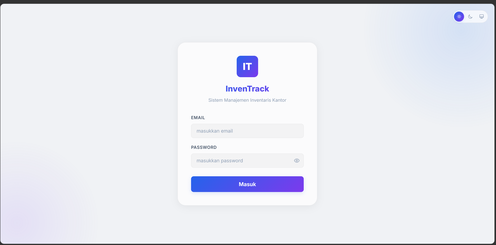
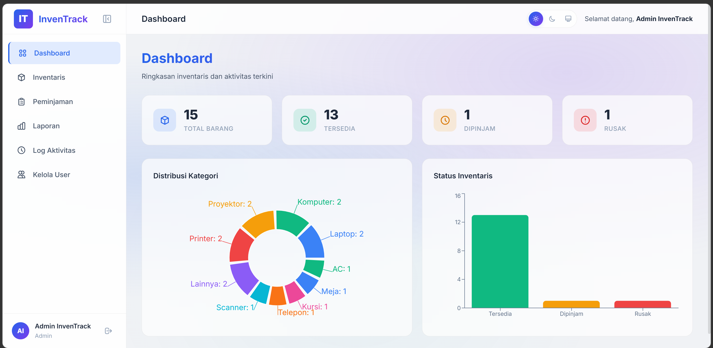
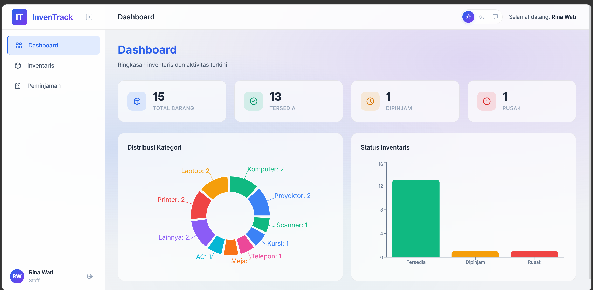
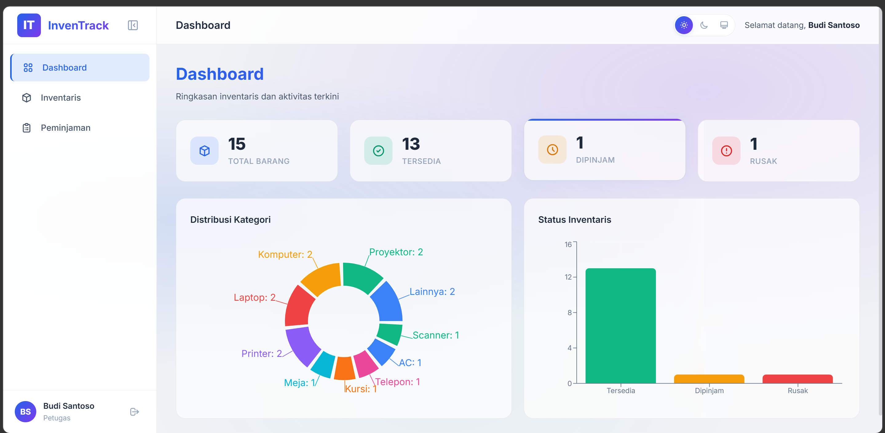
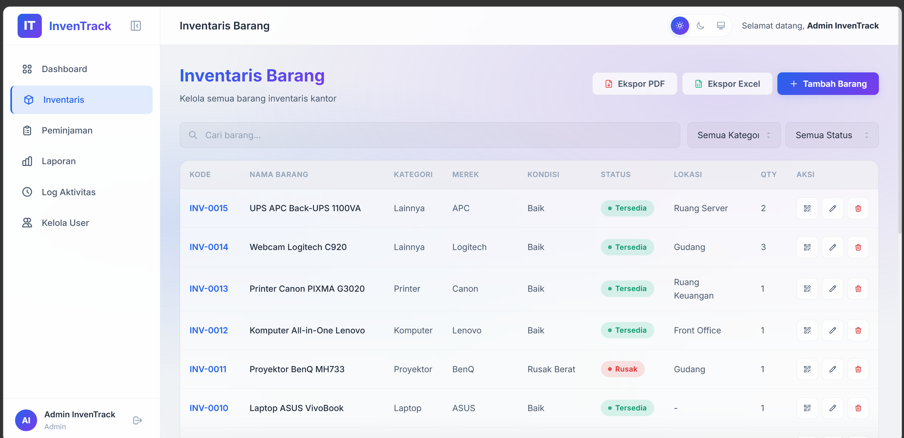
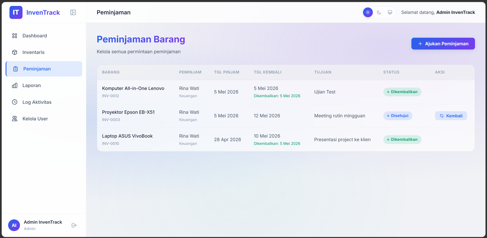
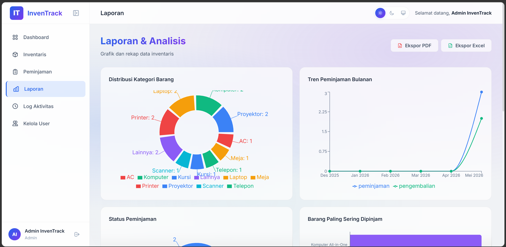
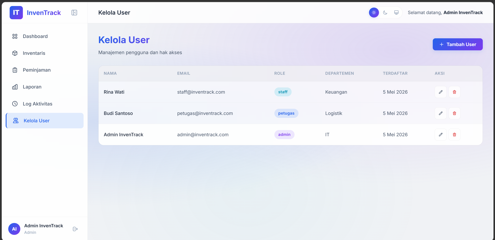

# 📦 InvenTrack — Sistem Manajemen Inventaris Barang

Aplikasi web full-stack untuk mengelola inventaris barang, peminjaman, dan pelaporan secara efisien.


---

## 📋 Daftar Isi

- [Tentang Project](#-tentang-project)
- [Fitur Utama](#-fitur-utama)
- [Tech Stack](#-tech-stack)
- [Arsitektur Sistem](#-arsitektur-sistem)
- [Struktur Folder](#-struktur-folder)
- [Prasyarat](#-prasyarat)
- [Instalasi & Setup](#-instalasi--setup)
- [Menjalankan Aplikasi](#-menjalankan-aplikasi)
- [Akun Default](#-akun-default)
- [API Endpoints](#-api-endpoints)
- [Sistem Role & Hak Akses](#-sistem-role--hak-akses)
- [Database Schema](#-database-schema)
- [Screenshots](#-screenshots)
- [Kontribusi](#-kontribusi)
- [Lisensi](#-lisensi)

---

## 📖 Tentang Project

**InvenTrack** adalah aplikasi web berbasis **MERN Stack** (MongoDB, Express.js, React.js, Node.js) yang dirancang untuk memudahkan pengelolaan inventaris barang di lingkungan kantor, sekolah, atau organisasi. Aplikasi ini mendukung pencatatan barang, sistem peminjaman & pengembalian, pelaporan, serta manajemen pengguna dengan sistem role-based access control.

> **Project UJIKOM** — Uji Kompetensi Keahlian

---

## ✨ Fitur Utama

### 📊 Dashboard

- Ringkasan statistik inventaris (total barang, dipinjam, rusak)
- Grafik distribusi barang per kategori (Pie Chart)
- Grafik tren bulanan (Bar Chart)
- Peminjaman terbaru & aktivitas terkini

### 📦 Manajemen Inventaris

- CRUD barang inventaris lengkap
- Auto-generate kode barang (`INV-0001`, `INV-0002`, dst.)
- Filter berdasarkan kategori, kondisi, dan status
- Pencarian barang secara real-time
- QR Code otomatis untuk setiap barang
- Kategori: Komputer, Laptop, Proyektor, Meja, Kursi, Printer, Telepon, Scanner, AC, Lainnya

### 🔄 Sistem Peminjaman

- Pengajuan peminjaman oleh staff
- Approval/reject oleh petugas atau admin
- Tracking status: `Menunggu` → `Disetujui` → `Dipinjam` → `Dikembalikan`
- Catatan tujuan peminjaman
- Riwayat peminjaman lengkap

### 📈 Laporan & Export

- Laporan ringkasan inventaris
- Distribusi barang per kategori
- Tren bulanan peminjaman
- Statistik peminjaman
- **Export PDF** (jsPDF)
- **Export Excel** (SheetJS/xlsx)

### 👥 Manajemen Pengguna

- CRUD user (admin only)
- Sistem role: Admin, Petugas, Staff
- Departemen pengguna

### 📝 Log Aktivitas

- Pencatatan semua aktivitas sistem
- Tracking siapa melakukan apa dan kapan
- Filter & pencarian log

### 🎨 UI/UX

- Dark/Light mode toggle
- Desain modern glassmorphism
- Responsive design
- Toast notification (react-hot-toast)
- Animasi & transisi halus

---

## 🛠 Tech Stack

### Frontend

| Teknologi        | Versi | Deskripsi               |
| ---------------- | ----- | ----------------------- |
| React            | 19.2  | Library UI              |
| Vite             | 8.0   | Build tool & dev server |
| React Router DOM | 7.14  | Client-side routing     |
| Axios            | 1.16  | HTTP client             |
| Recharts         | 3.8   | Library grafik/chart    |
| React Icons      | 5.6   | Icon library            |
| React Hot Toast  | 2.6   | Notifikasi toast        |
| jsPDF            | 4.2   | Export PDF              |
| xlsx (SheetJS)   | 0.18  | Export Excel            |
| QRCode.react     | 4.2   | Generator QR Code       |

### Backend

| Teknologi  | Versi | Deskripsi             |
| ---------- | ----- | --------------------- |
| Node.js    | -     | Runtime JavaScript    |
| Express.js | 4.21  | Web framework         |
| MongoDB    | -     | NoSQL database        |
| Mongoose   | 8.7   | ODM untuk MongoDB     |
| JWT        | 9.0   | Autentikasi token     |
| bcryptjs   | 2.4   | Hashing password      |
| Morgan     | 1.10  | HTTP request logger   |
| dotenv     | 16.4  | Environment variables |

### Dev Tools

| Teknologi       | Deskripsi           |
| --------------- | ------------------- |
| Nodemon         | Auto-restart server |
| Vitest          | Unit testing        |
| Testing Library | Component testing   |
| ESLint          | Code linting        |

---

## 🏗 Arsitektur Sistem

```
┌─────────────────┐         ┌──────────────────┐         ┌─────────────────┐
│                 │  HTTP   │                  │ Mongoose│                 │
│   React Client  │◄──────►│  Express Server   │◄──────►│    MongoDB      │
│   (Vite :5173)  │  REST   │  (Node.js :5000)  │         │  (Port 27017)   │
│                 │   API   │                  │         │                 │
└─────────────────┘         └──────────────────┘         └─────────────────┘
      │                            │
      │ - React Router             │ - JWT Auth
      │ - Context API              │ - Role-based Access
      │ - Axios Interceptor        │ - Error Handler
      │ - Recharts                 │ - Morgan Logger
      └────────────────────────────┘
```

---

## 📁 Struktur Folder

```
UJIKOM/
├── client/                     # Frontend (React + Vite)
│   ├── public/                 # Static assets
│   ├── src/
│   │   ├── components/         # Komponen reusable
│   │   │   ├── Modal.jsx       # Komponen modal dialog
│   │   │   ├── Navbar.jsx      # Navigasi atas
│   │   │   ├── ProtectedRoute.jsx  # Route guard (auth + role)
│   │   │   └── Sidebar.jsx     # Navigasi samping
│   │   ├── context/            # React Context (state global)
│   │   │   ├── AuthContext.jsx  # Autentikasi & user state
│   │   │   └── ThemeContext.jsx # Dark/Light mode
│   │   ├── pages/              # Halaman-halaman utama
│   │   │   ├── LoginPage.jsx       # Halaman login
│   │   │   ├── DashboardPage.jsx   # Dashboard utama
│   │   │   ├── InventoryPage.jsx   # Manajemen barang
│   │   │   ├── BorrowingPage.jsx   # Manajemen peminjaman
│   │   │   ├── ReportsPage.jsx     # Laporan & export
│   │   │   ├── UsersPage.jsx       # Manajemen pengguna
│   │   │   └── ActivityLogPage.jsx # Log aktivitas
│   │   ├── services/
│   │   │   └── api.js          # Axios instance & interceptor
│   │   ├── utils/
│   │   │   └── exportUtils.js  # Utility export PDF/Excel
│   │   ├── styles/
│   │   │   └── index.css       # Stylesheet utama
│   │   ├── __tests__/          # Unit tests
│   │   ├── App.jsx             # Root component & routing
│   │   └── main.jsx            # Entry point React
│   ├── index.html              # HTML template
│   ├── vite.config.js          # Konfigurasi Vite
│   ├── eslint.config.js        # Konfigurasi ESLint
│   └── package.json
│
├── server/                     # Backend (Express.js)
│   ├── config/
│   │   └── db.js               # Koneksi MongoDB
│   ├── controllers/            # Logic handler
│   │   ├── authController.js   # Login, register, getMe
│   │   ├── itemController.js   # CRUD barang
│   │   ├── borrowingController.js  # CRUD peminjaman
│   │   ├── reportController.js # Data laporan & statistik
│   │   └── userController.js   # CRUD user & activity log
│   ├── middleware/
│   │   ├── auth.js             # JWT verify & role authorization
│   │   └── errorHandler.js     # Global error handler
│   ├── models/                 # Mongoose schemas
│   │   ├── User.js             # Schema pengguna
│   │   ├── Item.js             # Schema barang inventaris
│   │   ├── Borrowing.js        # Schema peminjaman
│   │   └── ActivityLog.js      # Schema log aktivitas
│   ├── routes/                 # API route definitions
│   │   ├── authRoutes.js       # /api/auth/*
│   │   ├── itemRoutes.js       # /api/items/*
│   │   ├── borrowingRoutes.js  # /api/borrowings/*
│   │   ├── reportRoutes.js     # /api/reports/*
│   │   └── userRoutes.js       # /api/users/*
│   ├── seeders/
│   │   └── seed.js             # Data dummy untuk development
│   ├── .env                    # Environment variables
│   ├── server.js               # Entry point server
│   └── package.json
│
├── docs/                       # Dokumentasi tambahan
├── .gitignore                  # Git ignore rules
└── README.md                   # Dokumentasi utama (file ini)
```

---

## 📋 Prasyarat

Pastikan software berikut sudah terinstall di komputer Anda:

| Software    | Versi Minimum | Download                                                      |
| ----------- | ------------- | ------------------------------------------------------------- |
| **Node.js** | v18+          | [nodejs.org](https://nodejs.org/)                             |
| **npm**     | v9+           | Sudah termasuk di Node.js                                     |
| **MongoDB** | v6+           | [mongodb.com](https://www.mongodb.com/try/download/community) |
| **Git**     | v2+           | [git-scm.com](https://git-scm.com/)                           |

---

## 🚀 Instalasi & Setup

### 1. Clone Repository

```bash
git clone https://github.com/username/inventrack.git
cd inventrack
```

### 2. Setup Backend (Server)

```bash
# Masuk ke folder server
cd server

# Install dependencies
npm install

# Buat file .env (atau edit yang sudah ada)
```

Buat file `.env` di folder `server/` dengan isi berikut:

```env
PORT=5000
MONGODB_URI=mongodb://localhost:27017/inventrack
JWT_SECRET=your_super_secret_key_here
JWT_EXPIRE=7d
```

> ⚠️ **Penting:** Ganti `JWT_SECRET` dengan secret key Anda sendiri untuk production!

### 3. Setup Frontend (Client)

```bash
# Masuk ke folder client
cd ../client

# Install dependencies
npm install
```

### 4. Seed Database (Data Awal)

```bash
# Dari folder server
cd ../server
npm run seed
```

Ini akan membuat data dummy termasuk:

- 3 user (admin, petugas, staff)
- 15 barang inventaris
- 2 sample peminjaman
- 3 log aktivitas

---

## ▶️ Menjalankan Aplikasi

### Development Mode

Buka **2 terminal** terpisah:

**Terminal 1 — Backend:**

```bash
cd server
npm run dev
```

Server akan berjalan di `http://localhost:5000`

**Terminal 2 — Frontend:**

```bash
cd client
npm run dev
```

Client akan berjalan di `http://localhost:5173`

### Production Build

```bash
# Build frontend
cd client
npm run build

# Jalankan server
cd ../server
npm start
```

---

## 🔑 Akun Default

Setelah menjalankan seeder, gunakan akun berikut untuk login:

| Role        | Email                    | Password     |
| ----------- | ------------------------ | ------------ |
| **Admin**   | `admin@inventrack.com`   | `admin123`   |
| **Petugas** | `petugas@inventrack.com` | `petugas123` |
| **Staff**   | `staff@inventrack.com`   | `staff123`   |

---

## 🔌 API Endpoints

### Authentication (`/api/auth`)

| Method | Endpoint             | Deskripsi          | Akses         |
| ------ | -------------------- | ------------------ | ------------- |
| `POST` | `/api/auth/login`    | Login user         | Public        |
| `POST` | `/api/auth/register` | Register user baru | Admin         |
| `GET`  | `/api/auth/me`       | Get current user   | Authenticated |

### Items / Barang (`/api/items`)

| Method   | Endpoint         | Deskripsi           | Akses          |
| -------- | ---------------- | ------------------- | -------------- |
| `GET`    | `/api/items`     | Ambil semua barang  | Authenticated  |
| `GET`    | `/api/items/:id` | Ambil detail barang | Authenticated  |
| `POST`   | `/api/items`     | Tambah barang baru  | Petugas, Admin |
| `PUT`    | `/api/items/:id` | Update barang       | Petugas, Admin |
| `DELETE` | `/api/items/:id` | Hapus barang        | Petugas, Admin |

### Borrowings / Peminjaman (`/api/borrowings`)

| Method | Endpoint                      | Deskripsi          | Akses          |
| ------ | ----------------------------- | ------------------ | -------------- |
| `GET`  | `/api/borrowings`             | Semua peminjaman   | Petugas, Admin |
| `GET`  | `/api/borrowings/my`          | Peminjaman saya    | Authenticated  |
| `POST` | `/api/borrowings`             | Ajukan peminjaman  | Authenticated  |
| `PUT`  | `/api/borrowings/:id/approve` | Setujui peminjaman | Petugas, Admin |
| `PUT`  | `/api/borrowings/:id/reject`  | Tolak peminjaman   | Petugas, Admin |
| `PUT`  | `/api/borrowings/:id/return`  | Kembalikan barang  | Petugas, Admin |

### Reports / Laporan (`/api/reports`)

| Method | Endpoint                             | Deskripsi               | Akses         |
| ------ | ------------------------------------ | ----------------------- | ------------- |
| `GET`  | `/api/reports/summary`               | Ringkasan inventaris    | Authenticated |
| `GET`  | `/api/reports/category-distribution` | Distribusi per kategori | Authenticated |
| `GET`  | `/api/reports/monthly-trends`        | Tren bulanan            | Admin         |
| `GET`  | `/api/reports/borrowing-stats`       | Statistik peminjaman    | Admin         |

### Users / Pengguna (`/api/users`)

| Method   | Endpoint                   | Deskripsi       | Akses |
| -------- | -------------------------- | --------------- | ----- |
| `GET`    | `/api/users`               | Semua pengguna  | Admin |
| `PUT`    | `/api/users/:id`           | Update pengguna | Admin |
| `DELETE` | `/api/users/:id`           | Hapus pengguna  | Admin |
| `GET`    | `/api/users/logs/activity` | Log aktivitas   | Admin |

### Health Check

| Method | Endpoint      | Deskripsi      |
| ------ | ------------- | -------------- |
| `GET`  | `/api/health` | Cek status API |

---

## 🔐 Sistem Role & Hak Akses

```
┌──────────────────────────────────────────────────────────┐
│                        ADMIN                             │
│  ✅ Semua fitur                                          │
│  ✅ Manajemen user                                       │
│  ✅ Laporan lengkap                                      │
│  ✅ Log aktivitas                                        │
│  ✅ CRUD barang                                          │
│  ✅ Approve/reject peminjaman                            │
├──────────────────────────────────────────────────────────┤
│                       PETUGAS                            │
│  ✅ CRUD barang                                          │
│  ✅ Approve/reject peminjaman                            │
│  ✅ Dashboard & laporan dasar                            │
│  ❌ Manajemen user                                       │
│  ❌ Laporan detail & log aktivitas                       │
├──────────────────────────────────────────────────────────┤
│                        STAFF                             │
│  ✅ Lihat barang                                         │
│  ✅ Ajukan peminjaman                                    │
│  ✅ Lihat peminjaman sendiri                             │
│  ✅ Dashboard dasar                                      │
│  ❌ CRUD barang                                          │
│  ❌ Approve/reject peminjaman                            │
│  ❌ Manajemen user & laporan                             │
└──────────────────────────────────────────────────────────┘
```

---

## 🗄 Database Schema

### User

| Field        | Type   | Keterangan                        |
| ------------ | ------ | --------------------------------- |
| `name`       | String | Nama lengkap (required)           |
| `email`      | String | Email unik (required)             |
| `password`   | String | Hashed dengan bcrypt (min 6 char) |
| `role`       | Enum   | `staff`, `petugas`, `admin`       |
| `department` | String | Departemen/bagian                 |
| `timestamps` | Date   | createdAt, updatedAt              |

### Item

| Field             | Type     | Keterangan                            |
| ----------------- | -------- | ------------------------------------- |
| `code`            | String   | Auto-generate (`INV-XXXX`)            |
| `name`            | String   | Nama barang (required)                |
| `category`        | Enum     | Komputer, Laptop, Proyektor, dll.     |
| `brand`           | String   | Merek barang                          |
| `condition`       | Enum     | `Baik`, `Rusak Ringan`, `Rusak Berat` |
| `status`          | Enum     | `Tersedia`, `Dipinjam`, `Rusak`       |
| `location`        | String   | Lokasi penyimpanan                    |
| `acquisitionDate` | Date     | Tanggal perolehan                     |
| `quantity`        | Number   | Jumlah (min: 0)                       |
| `description`     | String   | Deskripsi barang                      |
| `createdBy`       | ObjectId | Referensi ke User                     |

### Borrowing

| Field              | Type     | Keterangan                                                     |
| ------------------ | -------- | -------------------------------------------------------------- |
| `item`             | ObjectId | Referensi ke Item                                              |
| `borrower`         | ObjectId | Referensi ke User (peminjam)                                   |
| `borrowDate`       | Date     | Tanggal pinjam                                                 |
| `returnDate`       | Date     | Tanggal kembali (required)                                     |
| `actualReturnDate` | Date     | Tanggal kembali aktual                                         |
| `status`           | Enum     | `Menunggu`, `Disetujui`, `Ditolak`, `Dipinjam`, `Dikembalikan` |
| `purpose`          | String   | Tujuan peminjaman (required)                                   |
| `notes`            | String   | Catatan tambahan                                               |
| `approvedBy`       | ObjectId | Referensi ke User (yang approve)                               |

### ActivityLog

| Field       | Type     | Keterangan                     |
| ----------- | -------- | ------------------------------ |
| `user`      | ObjectId | Referensi ke User              |
| `action`    | String   | Jenis aksi (CREATE_ITEM, dll.) |
| `target`    | String   | Deskripsi target aksi          |
| `targetId`  | ObjectId | ID objek terkait               |
| `details`   | Mixed    | Detail tambahan                |
| `timestamp` | Date     | Waktu aktivitas                |

---

## 📸 Screenshots

> 💡 Tambahkan screenshot aplikasi Anda di sini setelah menjalankan aplikasi.

### Login


### Dashboard




### Inventory


### Borrowing


### Reports


### Users


---

## 🧪 Testing

```bash
# Jalankan unit test
cd client
npm run test

# Jalankan test sekali (tanpa watch mode)
npm run test:run
```

---

## 🤝 Kontribusi

1. Fork repository ini
2. Buat branch baru (`git checkout -b fitur/FiturBaru`)
3. Commit perubahan (`git commit -m 'Menambahkan fitur baru'`)
4. Push ke branch (`git push origin fitur/FiturBaru`)
5. Buat Pull Request

---

## 📄 Lisensi

Project ini dibuat untuk keperluan **Uji Kompetensi Keahlian (UJIKOM)**.

---

<p align="center">
  Dibuat dengan ❤️ menggunakan <strong>MERN Stack</strong>
</p>
